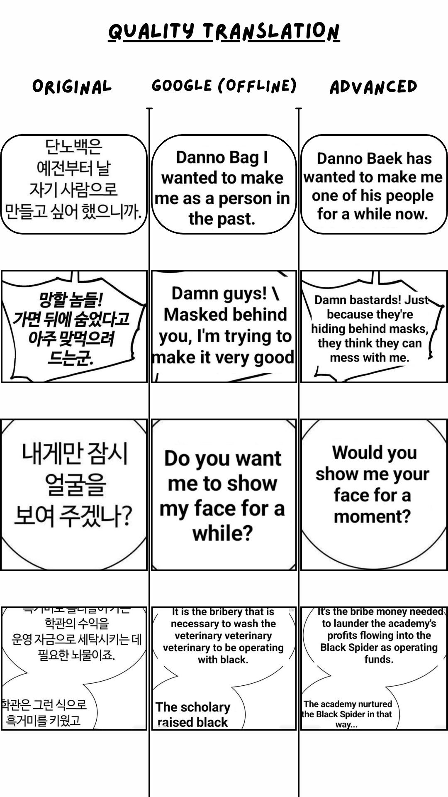

# Cosmo-Screen-Image-Translate
Android Screen &amp; Image (Manga/Manhwa) Translator

## Screen Translation

### Core Features
- **Floating Button Overlay**: Provides a non-intrusive floating button that can be positioned anywhere on screen
- **Quick Translation Mode**: Capture and translate any visible screen content with a single tap
- **Auto Translation Mode**: Automatically detects screen changes and translates new content
- **Real-time Translation**: Displays translations directly over the original text
- **Multiple Layout Modes**:
  - General: Best for standard horizontal text
  - Comic Vertical Text: Optimized for comics with vertical text and right-to-left reading
  - Comic Horizontal Text: Optimized for comics with horizontal text and top-to-bottom reading

## Batch Image Translation

### Core Features
- **Folder Selection**: Process entire folders of images at once
- **Recursive Processing**: Handle nested folder structures
- **Progress Tracking**: Real-time progress indicator during translation
- **Multiple Output Formats**:
  - Individual Images: Preserves original folder structure
  - PDF: Creates PDF files for folders with 4+ images (optimized for reading)
  - CBZ: Comic Book ZIP format compatible with most comic readers
  - ZIP: Standard archives for sharing and storage

### Processing Options
- **Text Layout Modes**: Same options as Screen Translation
- **Output Compression**: Adjust image quality vs. file size
- **Compress/Convert Only**: Skip translation to just convert formats

## Advanced Image Translation

### Core Features
- **Individual Image Editing**: Precise control over translation of single images
- **Text Detection**: Identify text areas in images for translation
- **Manual Text Editing**: Edit detected text before translation
- **Translation Editing**: Modify translated text before applying
- **Batch Processing**: Detect and translate text across multiple images
- **Save Changes**: Apply translations directly to image files
- **AI Chat Integration**: Easily use external AI Chat apps for translation:
  1. Tap detect all pages and translate button
  2. Tap Edit Detected List button
  3. Tap copy all entries button
  4. Paste and translate using free/paid AI chat apps (user discretion)
  5. Copy the result
  6. Tap paste all entries button
  7. Tap Paint translations to images button

### Viewing Options
- **Image Navigation**: Browse through images in a folder
- **Tall Mode**: Continuous scrolling view for reading long comics

### Editing Tools
- **Move Tool**: Standard navigation mode
- **Color Picker**: Select colors from the image
- **Paint Bucket**: Fill areas with selected color
- **Merge Tool**: Easily combine multiple images into one
- **Split Tool**: Easily divide images into separate files
- **Text Overlay**: View and edit text overlays
- **Clipboard Operations**: Copy all detected entries and paste all entries for efficient text management
